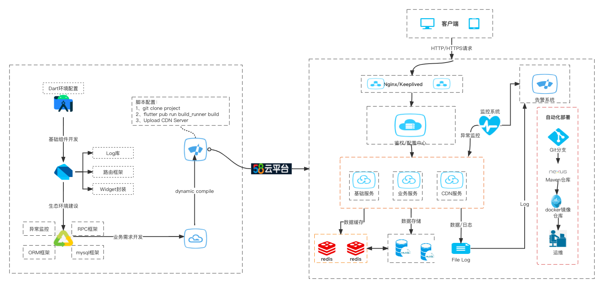

整体从初次接触Server开发者角度分析主要分为两个流程开发阶段和部署阶段
#### 同步FairPushy Server工程代码

推荐同步相关代码，并且修改本地配置信息进行部署：

同步方式:

```
git clone https://github.com/wuba/FairPushy.git
```

#### 配置信息

项目中使用的数据库是基于MySql在远端部署，因此需要填写MySql表名、密码、端口等信息。切换到FairServer工程找到bin/config.dart修改以下信息:
```
const settingsYaml = '''
mysql_user: 
mysql_password: 
mysql_host: 
mysql_port: 
mysql_database: 
''';
```


#### 测试服务

FairPushy工程可以直接运行启动测试服务仅需在控制台输入以下命令:
```
 dart run bin/server.dart
```
控制台打印：FairServer ready 证明服务已正常启动，在浏览器输入"获取资源文件接口"检查服务是否正常
```
 http://127.0.0.1:8080/app/patch
```
正常情况会收到以下提示：
```
{
    "code": -2,
    "data": null,
    "msg": "bundleId==null"
}
```
#### 表创建

由于部分远端DB限制，目前需要手动创建表，提供以下创建语句和表结构：


#### 接口说明

项目中主要提供Web平台的接口和移动端SDK调用接口一共大概10个左右，主流程接口如下：

序号 | 接口地址 | 功能描述   |
| -- | ---- | ------ |
| 1 |   /web/createApp   | 创建项目  |
| 2 |    /web/getAppList  | 获取项目列表  |
| 3 |    /web/module_patch | 补丁列表   |
| 4 |    /web/create_patch  | 上传补丁   |
| 5 |    /web/operating_record  | 操作记录   |


