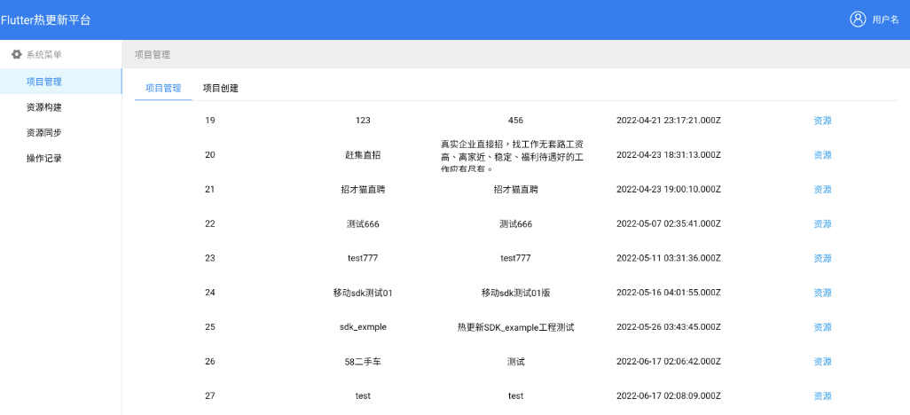
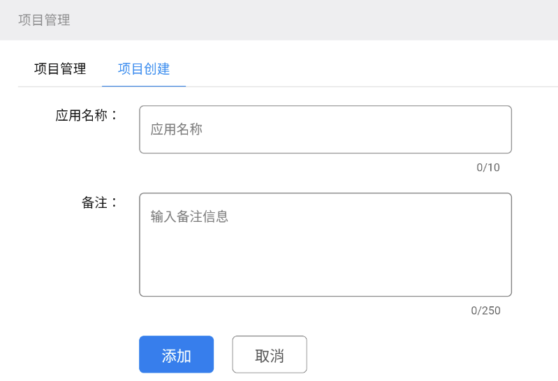
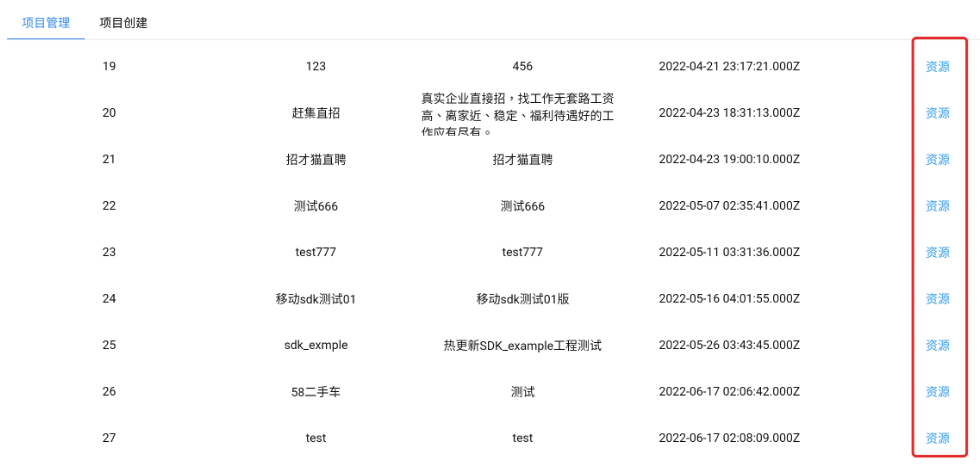
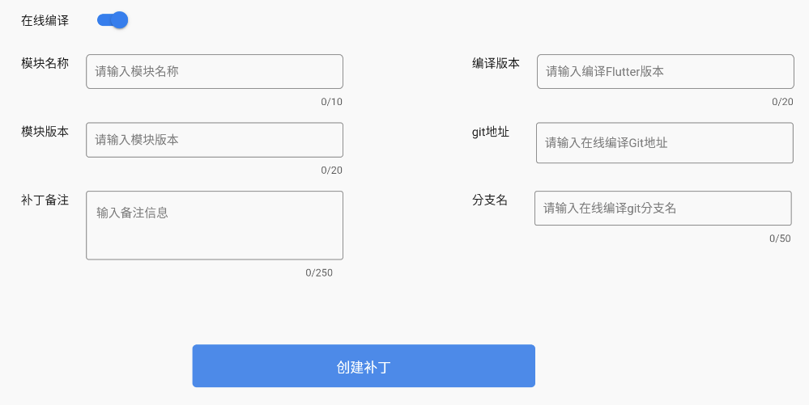
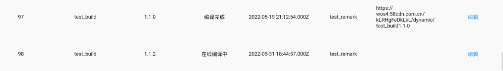
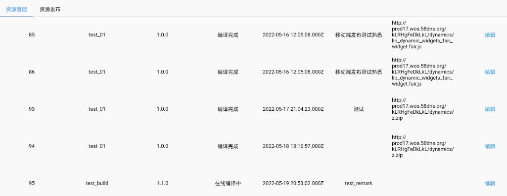

## Fair热更新平台

##### 简介

Fair 热更新平台是配合Fair 核心能力生态组成的一部分，可以让用户使用可视化的操作方式来配套使用Fair 的动态能力，目前已经完成一期，目前支持项目的创建，针对项目创建对应的资源包，实现下发资源，客户端再通过生成的url 来获取资源文件，实现Fair的动态化能力。大概样式如下图

一期只是从项目和资源俩个维度来支持Fair 的动态化能力。要使用平台完成下发，首先需要创建一个项目，目前没有做用户鉴权，平台功能也已跑通整个流程为主，注意创建完的项目对所有用户可见，所以建议平台只是用来验证测试动态能力为主，不建议生产环境使用。

##### 创建项目

输入应用的名称和备注信息，就可以创建一个项目，这个流程基本没有任何疑问点。目前不支持项目的删除和修改，如果需要修改可以再次创建一个新项目。

##### 创建资源

项目创建完成之后，就可以针对项目去创建对应的资源了。具体的入口是在项目的列表里通过点击对应的资源入口进入资源页面。

点击资源之后就可以进入该项目的资源页面，可以看到资源的列表或者创建资源页面。创建资源需要填写一些响应的字段参数。目前支持在线编译和手动上传编译产物创建资源俩种方式。

- ###### 	在线编译

默认是在线编译模式，可以填入对应的模块名称 和版本以及补丁的备注，另外就是填写在线编译需要的 编译版本和Flutter 项目的git 地址和分支名以及编译所需要的Flutter 版本。填写完成之后就点击创建补丁就可以了。此时会在资源列表生成一个资源项，状态是编译中。等到云端编译完成之后就会变成编译完成的状态。

- ###### 手动上传

如果是选择手动上传可以关闭在线编译的开关，这个时候表单就会切换到手动上传文件的样式

这个时候支持手动填写上传补丁的链接，如果想使用文件上传功能，目前的上传文件功能是上传到五八内部的文件服务，所有需要自己修改源码，更换上传的服务url, 来使用文件的上传功能呢。同样完成之后点击创建补丁，此时资源列表会生成一个资源项，状态直接是编译完成。

##### 修改资源

如果想修改上传的资源，可以点击资源列表资源项的编辑按钮，会出现修改的弹框，可以修改字段，如果是在线编译会重新编译打包，如果是手动上传会直接编译完成。

**关于项目中资源包上传功能的说明**

由于在开发时候使用的是内部的环境，所以相关的域名已经删除，如果想使用文件上传，可以修改源码填充自己公司的域名，或者使用在线编译功能。

